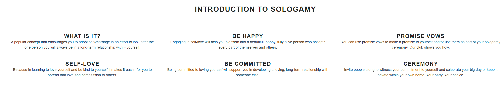
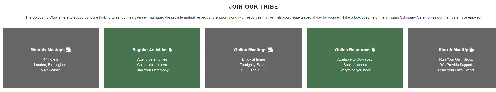
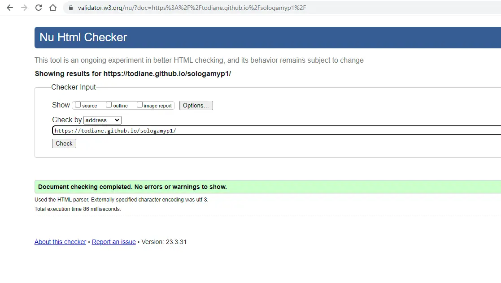

# Sologamy Club

The Sologamy club is a site that aims to support anyone looking to **embrace the idea of marriage by a person to themself** by providing information and support on the topic. The website targets anyone looking to learn more about sologamy and also encourages those looking to run their own event to register and become a member where additonal support and the opportunity to meet other members is available both offline in local venues and online via zoom.

Project Aims to:

- provide information on the topic of Sologamy: what it is and why people embrace it.
- outline benefits of being a member, both offline as meetups and online, to encourage users to join.
- provide social proof of people taking part in a sologamy ceremony with members permission.
- set up a working registration form so users can register to join.

## Features

This website has been built using a reponsive design. It is a three-page website that includes a homepage, ceremonies page and a registration page. The website uses a charcoal font with the main body font being Monserrat and the H1 and H2 headers in Open Sans.

### **Navigation**

Featured at the top of each page, the navigation includes the name of the club on the left - SOLOGAMY CLUB - which also links to the top of the index page.

On the right-hand side of the website are the navigation links which are included on all three pages. Home - linking to the index page, Ceremonies - providing photos of members and Register - where potential members can join. The linked menu allows for easy access to each page without having to click on the back button. There is also an internal link on the index page to the ceremonies page and an internal link on the ceremonies page to the registration page allowing for an easy flow for users to go from one point to another without needing to scroll back to the top.

### **Website Pages**

***Index / Home Page***

The Home page includes a full-width image of a hand with a ring and a reminder to embrace self-love as the greatest love of all. The lyrics have been taken from a song by Whitney Houston.

Introduction: This is an information website so contains more text than images and instantly begins with information on Sologamy explaining what it is and why people embrace it as an important life purpose.

Joining the club: Further down users are invited to join the club and five information boxes outline the benefits of being a member.

Videos to watch: The last section of information provides external links to two videos with a brief explaination of the topic of each video. External links open in a new window.

The footer section contains links to the Sologamy Club social media pages.

***Ceremonies Page***

The ceremonies page provides potential users with evidence of club members and how they spent their day. It doese not include the main header that appears on the other two pages. Different images were used to include a variety of people from someone taking the journey alone to others celebrating with family and some with friends.

This section provides the social proof a user needs before joining if they are considering running their own event.

Titles have been added to each photo which provides uers with a brief explaination of what is happening in the photo they are looking at and is accessible when they move their mouse over a photo. This only works if you are using a mouse so will not show on tech that doesn't include one e.g. mobiles.

At the end of the page are links to our social media profiles.

In the future the aim is to include videos that members have shared on TickTok and/or YouTube to this page.

***Register Page***

This page has been kept brief in order to encourage users to take one action without the need to read loads of content. There is the header which appears on the Home page. The registration form asks for minimal details and includes reference to whether they wish to take part in offline meetups and/or online meetups.

It also includes a question relevant to our business about how they found the website but this is not a required field.

At the end of the page are links to our social media profiles.

### **Features Left to Implement**

There are many external stories, news items, documentaries and videos on the topic and a page outlining these is a potential feature idea.

Create a download page for members only that contains eBooks, planners and other material that will help them organise their day.

### **Testing**

The website has been tested to work in different browers including Edge, Firefox and Chrome

While using the original html and css code of the Love Running website on the introduction section of the index page removing the central image and replacing it with text did not work. The section would not center and was below the left and right areas at times. That was changed to using a flexbox for the three areas. Using rows I separated the six items into two rows, however the text spread out across the site and I could not leave a space inbetween each title. Finally, I used a grid. With the grid I was able to leave column space and separate each item so it looked neater.

Using DevTools I was able to check the responsiveness of the website on different screens and adjust the code as needed to ensure the content was still readable and accessible. On the ceremonies page I reduced the 4 column images to 3 for screens under 1058px and down to 2 columns for screens under 800px.

The @media screen sizes were decided upon based on what the website did at certain sizes and once it changed dramatically a smaller @media section was created until it fit perfectly on anything under 500px.

All links to external pages have been checked.

The form on the register page has been checked and works. The success message shows at the end. An @ must be used in the email field otherwise an error message is shown.

### **Validator Testing**

***HTML***
No errors were found when the code was entered into the offical 

***CSS***
No errors were found when the code was entered into the official Jigsaw validator

***Accessibility***

The site was run through the DevTools Lighthouse section and deemed to be 100% for accessibility which confirms that the font and colors chosen are easy to read

### **Unfixed Bugs**

No unfixed bugs to report.

### **Deployment**

The site was deployed to GitHub pages. The steps to deploy are as follows:

- In the GitHub repository, navigate to the repositories on the right and click on the relevant one to open up the project.
- Go to Settings tab and then down to the tab called Pages.
- From the source section drop-down menu, select "Deploy from a branch".
- Directly under is Branch. Select "main" and "root" then click on save.
- A few minutes later GitHub will provide a link to the live site which indicates successful deployment.

The live link can be found here - <https://todiane.github.io/sologamyp1/>

### **Credits**

The Sologamy Club header, footer and structure of this website has been created using html and css code elements from the  Code Institute Love Running website. The Love Running three page website has been recreated for this project. <https://code-institute-org.github.io/love-running-2.0/index.html>

Photos on the ceremonies page have been downloaded from <https://pexels.com> and the website <https://convertio.co>  was used to convert the png and jpg images into a webp image to ensure they load quickly when the website is deployed.

Font awesome icons were used from <https://fontawesome.com>
